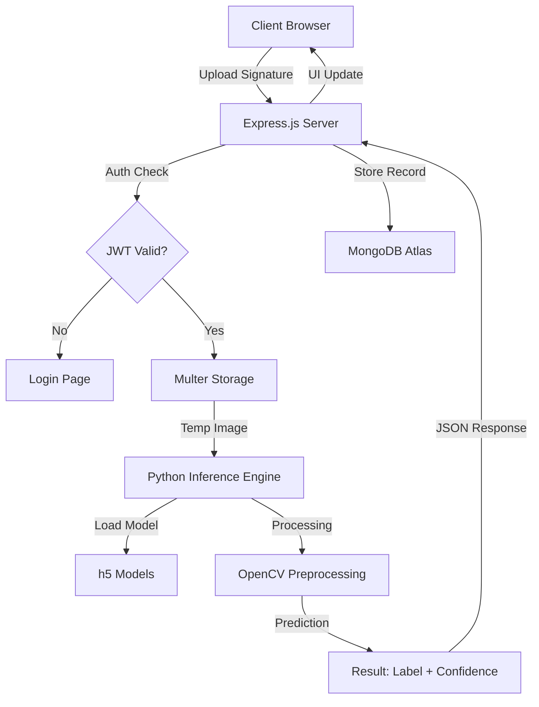

# 🖊️ AI-Powered Signature Verification System


[](https://nodejs.org/)
[](https://www.python.org/)
[](https://www.mongodb.com/)
[](https://opensource.org/licenses/MIT)

> A state-of-the-art, deep learning-based system designed to detect and verify handwritten signatures with high precision. Built with a robust hybrid architecture combining Node.js scalability and Python's AI capabilities.

---

## 🚀 Key Features

*   **🧠 Deep Learning Engine**: Utilizes custom-trained Convolutional Neural Networks (via H5 models) for high-accuracy signature analysis.
*   **🛡️ Multi-Factor Security**: Secure user authentication powered by JWT (JSON Web Tokens) and Bcrypt password hashing.
*   **✨ Premium UI/UX**: Ultra-modern, responsive interface featuring glassmorphism, smooth animations, and dark mode support.
*   **📊 Verification History**: Personal dashboard to track, view, and manage all past verification attempts with high-resolution image previews.
*   **👤 Comprehensive Profiles**: Manage user identity, bio, and profile imagery within a secure ecosystem.
*   **⚡ Real-Time Processing**: Instant verification results with detailed confidence scores.

---

## 🛠️ Tech Stack

### **Frontend**
- **Architecture**: Single Page Application (SPA) flow with Vanilla JS.
- **Styling**: Modern CSS3 Custom Properties, Flexbox/Grid, and Keyframe Animations.
- **Visuals**: Glassmorphism UI, Google Fonts (Inter/Outfit).

### **Backend**
- **Server**: Node.js & Express.js.
- **Authentication**: JWT Cookies + Bcrypt.
- **File Handling**: Multer for high-performance multipart/form-data.

### **Internal AI Engine**
- **Language**: Python 3.8+.
- **Vision**: OpenCV (Image Preprocessing & Grayscale Conversion).
- **Inference**: Custom NumPy implementation for efficient forward-pass prediction using pre-trained weights.

### **Database & Storage**
- **Database**: MongoDB Atlas (NoSQL).
- **File Storage**: Local/Cloud storage for signature history.

---

## 📐 System Architecture



---

## 🔄 The Workflow

1.  **Preprocessing**: The uploaded signature is converted to grayscale and resized to a standard `150x150` resolution to ensure consistency.
2.  **Normalization**: Pixel values are normalized between 0 and 1 to optimize the neural network's activation functions.
3.  **Forward Pass**: The Python engine loads the specific `.h5` model for the target user. It executes a deep neural network pass using **Leaky ReLU** and **Softmax** activations.
4.  **Classification**: The system outputs a binary classification: `Genuine` or `Forged`.
5.  **Validation**: A confidence percentage is calculated based on the Softmax distribution, providing an added layer of certainty for the user.

---

## 📂 Project Structure

```text
signature_verification/
├── banner.png               # Project Banner
├── js/                      # Backend (Node.js & Python)
│   ├── server.js            # Main Express Server
│   ├── app.py               # ML Logic (Python)
│   ├── models/              # Schema Definitions (Mongoose)
│   └── trained_models/      # AI Model Repository (.h5)
├── templates/               # Frontend (HTML/CSS/JS)
│   ├── index.html           # Landing Page
│   ├── main.html            # Verification Dashboard
│   ├── profile.html         # User Profile
│   ├── css/                 # Premium Stylesheets
│   └── js/                  # Interactivity Logic
├── uploads/                 # Storage for Uploaded Images
├── signatures_of_candidates/ # Dataset Repository
└── requirements.txt         # Python Dependencies
```

---

## ☁️ Deployment

### Deploying to Render

1. **Prepare the Repository**: Ensure `Dockerfile` and `render.yaml` are in the root directory.
2. **Connect to Render**:
   - Create a new **Web Service** on [Render](https://render.com).
   - Connect your GitHub repository.
   - Render will automatically detect the `render.yaml` file.
3. **Environment Variables**:
   Set the following in the Render Dashboard (Environment tab):
   - `MONGODB_URI`: Your MongoDB Atlas connection string.
   - `JWT_SECRET`: A secure key for session signing.
4. **Deploy**: Render will build the Docker container and deploy the app.

---

## 🚦 Getting Started

### Prerequisites
- **Node.js**: v18.0.0 or higher
- **Python**: v3.8.0 or higher
- **MongoDB**: Access to a MongoDB Atlas cluster or local instance

### Installation

1. **Clone & Enter**
   ```bash
   git clone https://github.com/rathodvamshi/signature_verification.git
   cd signature_verification
   ```

2. **Install Environments**
   ```bash
   npm install
   pip install -r requirements.txt
   ```

3. **Configure Environment**
   Create a `.env` file in `js/models/`:
   ```env
   PORT=3000
   MONGODB_URI=your_mongodb_connection_string
   JWT_SECRET=your_ultra_secure_secret
   ```

4. **Launch Application**
   ```bash
   npm start
   ```

---

## 🔒 Security & Privacy

This project implements industry-standard security practices:
- **Session Security**: JWTs stored in `HttpOnly` cookies to prevent XSS attacks.
- **Data Integrity**: Passwords are never stored in plain text; Bcrypt salts and hashes are used.
- **Sanitization**: Strict file filtering (JPEG/PNG only) and metadata stripping during processing.

---

## 👤 Author

**Vamshi Rathod**
- Full-stack Developer & AI Enthusiast
- [GitHub](https://github.com/rathodvamshi)

---
*Built with ❤️ for secure document authentication.*
